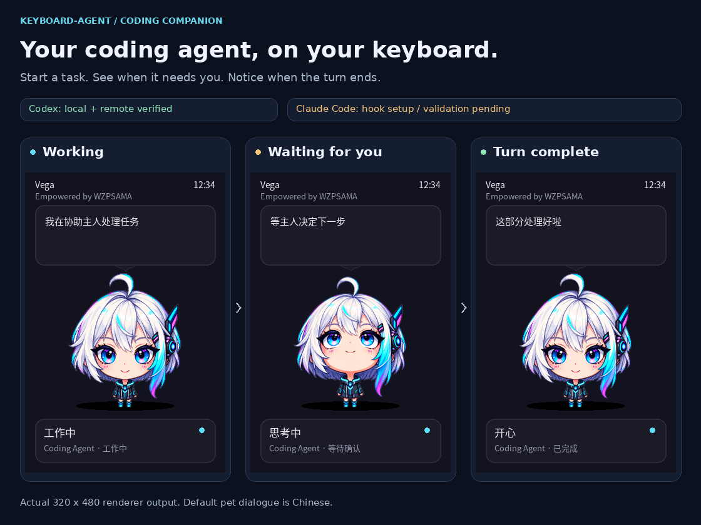
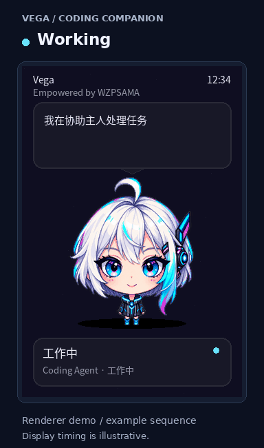
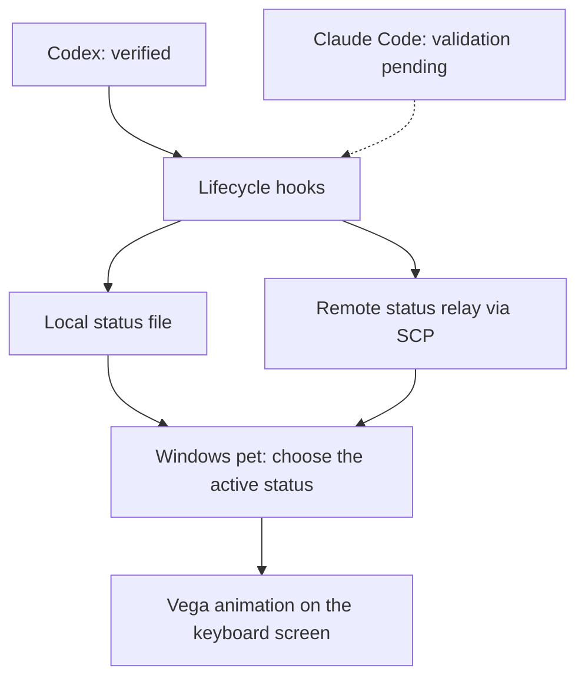

# Keyboard-Agent — an AI pet that lives in your keyboard

Turn the 3.98" IPS screen (320×480) of the **AULA L99** mechanical keyboard into
the face of a cyberpunk AI pet — **Vega**, a silver-haired, red-eyed girl who
waits for you at home.

**See your coding agent's progress on your keyboard.** Vega reacts to work,
approval requests, and the end of a turn with on-screen expressions and
animations. Codex is verified locally and remotely; Claude Code hook integration
is documented, with end-to-end validation pending.

**Runs as a single local process on your Windows PC**, talking to the screen
directly through the keyboard's official driver chain (Image2Bin →
SerialPortTool → COM3).

<p align="center">
  
</p>

## Your coding companion: Codex & Claude Code

Keep working in your editor while Vega shows what your coding agent is doing.
Starting a turn brings up the working scene with a subtle blink and status-light
pulse. A permission request switches to a waiting expression; finishing a turn
triggers a happy bounce. When the status expires, ordinary pet interactions
resume unless another source is still active.

| Integration | Release status |
|---|---|
| Codex CLI on the Windows PC | End-to-end verified, including the keyboard display |
| Codex in a configured remote environment | End-to-end verified through the private status relay |
| Claude Code | Hook integration documented; end-to-end validation pending |

<p align="center">
  
</p>

These previews use the same status mapping, sprites, and renderer as
`win_agent.py`. The on-screen dialogue is Chinese; the captions explain each
state in English. Completion means the agent's turn ended, not that its output
has been independently verified.

<details>
<summary>Watch the working → waiting → completion animation</summary>

<p align="center">
  
</p>

Renderer demo with illustrative timing, not a recording of a live coding task.
Waiting is an optional branch: a turn can finish without requesting approval.

</details>



Hooks send only a state, revision, and timestamps. The status bridge makes no
additional model calls and does not read task text or inspect editor windows.
Local and remote sources keep independent revisions; repeated states do not
cause repeated screen writes. Animations loop on the keyboard after transfer
through the official GIF → Image2Bin → SerialPortTool → COM3 chain.

[Set up Codex or the Claude Code hook mapping](docs/CODING_STATUS_BRIDGE.md).
Install hooks in the environment that runs the coding agent, review any required
trust prompt, and verify with a new turn in that same host.

## Quick start

1. Install the official **AULA L99 driver** (bundles `Image2Bin.exe` and
   `SerialPortTool.exe`, default at `C:\Program Files (x86)\AULA L99\qt-tool`).
2. Plug the keyboard in via USB (serial port defaults to `COM3`).
3. Double-click `setup_windows.bat` — creates a venv, installs Pillow, and
   renders a self-test frame.
4. Double-click `start_agent.bat` — runs in the foreground with logs.
   `run_agent.bat` starts it without a persistent console window. Output goes to
   rotating local `agent_run.log` files.
5. Optional: run `setup_autostart.bat` to install a per-user, windowless Startup
   shortcut. Run it again after upgrading an older batch-based autostart entry.
   `setup_autostart.bat --remove` removes the entry.
6. Optional: connect coding-agent lifecycle events to Vega. Codex local and
   remote paths are verified; Claude Code validation is pending. See the
   [coding-agent status bridge](docs/CODING_STATUS_BRIDGE.md).

> Port not `COM3`? Set the `AULA_COM` environment variable, or edit `PORT` /
> `QT_TOOL` at the top of `pusher/push_local.py`.

## How it works

```
             ┌──────────────────────────────────────────────┐
             │  win_agent.py  (single local process)        │
             │                                              │
             │  WH_KEYBOARD_LL hook — keys around the screen│
             │  GetLastInputInfo     — user activity        │
             │  Event bus + interaction registry (pluggable)│
             │  Offline brain (states.offline_next)         │
             │  renderer/            — state → 320×480 frame│
             │  pusher/push_local.py — GIF → Image2Bin →    │
             │       SerialPortTool → keyboard screen (COM3)│
             └──────────────────────────────────────────────┘
```

- **Offline & free** — no API by default; mood is driven by a local state machine.
  `agent/brain.py` ships an optional Claude online brain (set `ANTHROPIC_API_KEY`,
  `pip install anthropic`, flip `Brain(offline=False)`).
- **Near-instant key reactions** — keys around the screen (↑/↓/←/→/Home/PgUp/…)
  make Vega turn to look, using pre-rendered `.bin` frames.
- **Why the official chain** — the screen only accepts the animated `.bin` header
  that `Image2Bin` produces; hand-rolled single frames cause a garbled top row and
  swapped colors. The driver's own toolchain is stable and correct.

## Moods & animations

`renderer/vega.py` picks the sprite from `mood` / `motion`:

| Mood | Status | Animation |
|---|---|---|
| `idle` / `working` / `talk` / `thinking` | — | Directional sprites (front / left / left_top / top — follows your keys) |
| `happy` | Happy | bounce |
| `excite` | Excited | surprised |
| `sleepy` | Sleepy | sleepy (eye mask + floating z's) |
| `music` | Listening | music |
| `cry` | Crying | 6-frame hand-drawn crying |

| bounce | sleepy | surprised |
|---|---|---|
|  |  |  |

| music | cry | look around |
|---|---|---|
|  |  |  |

Action animations only appear in the transient "speak / react" GIFs; the
directional look sprites are unaffected. Centered ambient scenes use a compact,
fixed-canvas four-frame blink loop with a pulsing status light. The character
does not grow or shrink to simulate breathing. The loop is transferred once and
then replayed by the keyboard screen without continuous PC-side pushes.

## Interactions

28 hand-crafted reactions in `agent/interactions.py`. Highlights:

### Keyboard

| Situation | Vega… |
|---|---|
| You mash the spacebar | gets excited and jumps along |
| You hammer Ctrl+V | teases you about "moving bricks again" |
| You delete a lot while editing | bursts into exaggerated tears toward the delete key |
| Caps Lock is left on while you type | gently points it out |
| You type really fast | cheers your hand speed — or tells you to calm down |
| You start gaming | turns into a spectator and roots for you |
| You frantically flip between windows | offers to help you find whatever you lost |
| You come back after a long break | welcomes you home |

### Foreground app

| Situation | Vega… |
|---|---|
| You switch to IDE / browser / office / game / terminal / media | greets you in that app's mood |
| You join a meeting | goes quiet and silently keeps you company |
| You game during work hours | catches you slacking off |
| You work late in the IDE | urges you to rest |
| You stay focused in the IDE | enters "flow mode" and stops interrupting |
| You binge videos for a long stretch | reminds you to rest your eyes |
| Your meeting ends | welcomes you back |

### System

| Situation | Vega… |
|---|---|
| The CPU / RAM runs hot | worries about the machine |
| The load settles back down | reports that it "cooled down" |
| You lock the screen | says goodbye |

### Music · weather · guessing

| Situation | Vega… |
|---|---|
| You start or change a song | grooves along and rates your taste |
| It rains or snows | reminds you about an umbrella / a warm coat |
| Morning | reads you the day's weather |
| You open a familiar app | guesses what you're up to (without ever reading titles aloud) |

### Companionship

| Situation | Vega… |
|---|---|
| A milestone together (7 / 30 / 100 days) | celebrates |
| Her intimacy level rises | says she feels closer to you |
| You stayed up late last night | asks if you've had your coffee |
| You're up past midnight | worries about you in real time |
| Late at night, you step away | yawns and dozes off (eye mask + floating z's) |
| Lunchtime | reminds you to eat |
| Friday evening | wishes you a happy weekend |
| Monthly anniversary | celebrates another month together |

Each interaction declares a `priority` (high preempts / med / low) and a `group`
(mutex groups like `"keyboard"`), arbitrated by `AgentContext.say` to avoid spam.

## Layout

```
win_agent.py                entry point (local resident agent)
agent/                      interactions, sensing, memory, state machine, brain
agent/coding_status.py      validated local/remote lifecycle status handoff
renderer/vega.py            Vega sprite rendering (directions + cry + actions)
renderer/render.py          state → 320×480 frame (RGB565 + PNG/GIF)
renderer/avatar.py          programmatic "dango" alt character + mood labels
pusher/push_local.py        GIF → Image2Bin → SerialPortTool (official chain)
assets/vega/                sprites (clean / cry / bounce / sleepy / surprised / music)
docs/                       setup guides, renderer previews, images & GIFs
scripts/                    sprite build / re-processing scripts
scripts/codex_status_hook.py   privacy-bounded Codex lifecycle emitter/relay
scripts/build_status_preview.py   rebuild README status previews without hardware
setup_windows.bat           one-click install
setup_autostart.bat         install/remove logon autostart (Startup folder)
scripts/autostart.ps1       create the windowless Startup shortcut
start_agent.bat / run_agent.bat   launch scripts
```

## Rebuilding sprites

- `scripts/process_vega.py` — white-background source → transparent direction sprites.
- `scripts/build_clean_sprites.py` — unify direction sprites to 447×415 full body.
- `scripts/build_cry_sprites.py` — 6 hand-drawn cry frames → cry sprites.
- `scripts/build_action_sprites.py` — generate the 4 action sets from `front.png`.
- `python scripts/build_status_preview.py` — regenerate `docs/coding-status.png`
  and `docs/coding-status.gif` from the production status mapping and renderer.
  Requires Pillow and a local CJK font for the pet's Chinese text. It does not
  run hooks, change live status, or connect to the keyboard.

## Privacy

The pet's memory (intimacy, sleep profile, active hours) lives only in the local
`data/pet_memory.json` — never uploaded. If the online brain is enabled, only
"current time + activity + memory summary" is sent to Claude, not raw window
titles (activity guessing is coarse-grained and never reads titles aloud).
Optional coding-agent status uses only fixed lifecycle enums; its private relay
configuration is documented in
[docs/CODING_STATUS_BRIDGE.md](docs/CODING_STATUS_BRIDGE.md).
